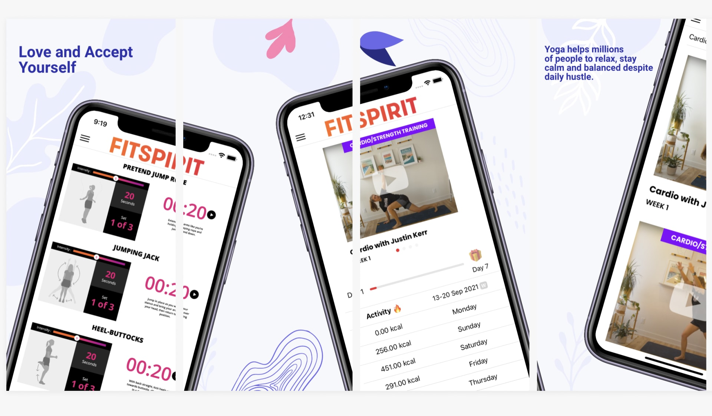

# Activity Awards - Morgan Stanley - Code to Give Hackathon

## The Issue
It is easy for an individual to assume that lack of activity is strictly a lack of discipline and failure of willpower. However, tackling adolescent inactivity with negative motivation is a misguided approach that can often worsen the situation. A self-paced, rewarding, and informative track and platform to reverse the trend of increasing physical inactivity in teenage girls is the way to fix it!

## Our Magic Solution
"Answer a few questions and participate in the quiz, to get to know you better. Then, get a customized track, which is fun, interactive, and self-paced. The best part? Get rewards, goodies, and badges for achieving every milestone."

## How it works?
- Answer a few questions: After installing the application on your mobile device, register, login, answer a few questions about yourself, and participate in a quiz; there are no wrong answers!
- Track, Track and Track: Let us track your fitness activity or add it yourself; every baby step towards your goal COUNTS. Progress is addictive, and once you get the hang of it, there's no going back.
- You deserve every bit of appreciation: Just like how Ash gets a badge for winning a pokemon gym battle, you get one too, just that, our battles are a lot more fun.

The current version of the application is only for IOS users and ideal for Apple Watch users.

## Installation
- Firebase Integration: https://www.remotestack.io/connect-firebase-to-ionic-app/
- npm install --save @ionic-native/health-kit
- Give access for HealthKit in "Capabilities" (Blog Post: https://devdactic.com/ionic-healthkit-integration/)
- Don't forget the info.plist in XCode to add description for data access: https://enappd.com/blog/best-fitness-plugins-for-ionic-4-how-to-use-pedometer/15/
- Set-up firebase for Auth and add firebaseConfig to environment.ts
- ionic capacitor run ios --livereload 

*Please note that Activity Awards is a Prototype and features mentioned may not be fully implemented or work as expected (development time: 2 days).*
